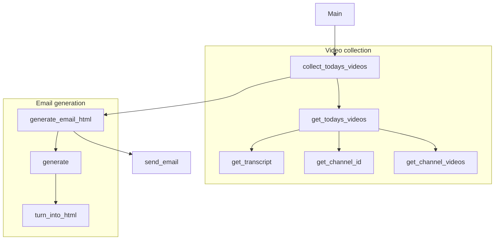

This script retrives the latest video by the youtubers whose id are listed in the `main.py` file.

The script uses the openrouter api.


.env FORMAT:

```
YOUTUBE_API_KEY=
GOOGLE_AI_API_KEY=
OPENROUTER_API_KEY=
EMAIL_ADDRESS=
EMAIL_PASSWORD=
EMAIL_RECIPIENT=
```



It makes a mail for the summary for the videos and mail it to you, like this:


